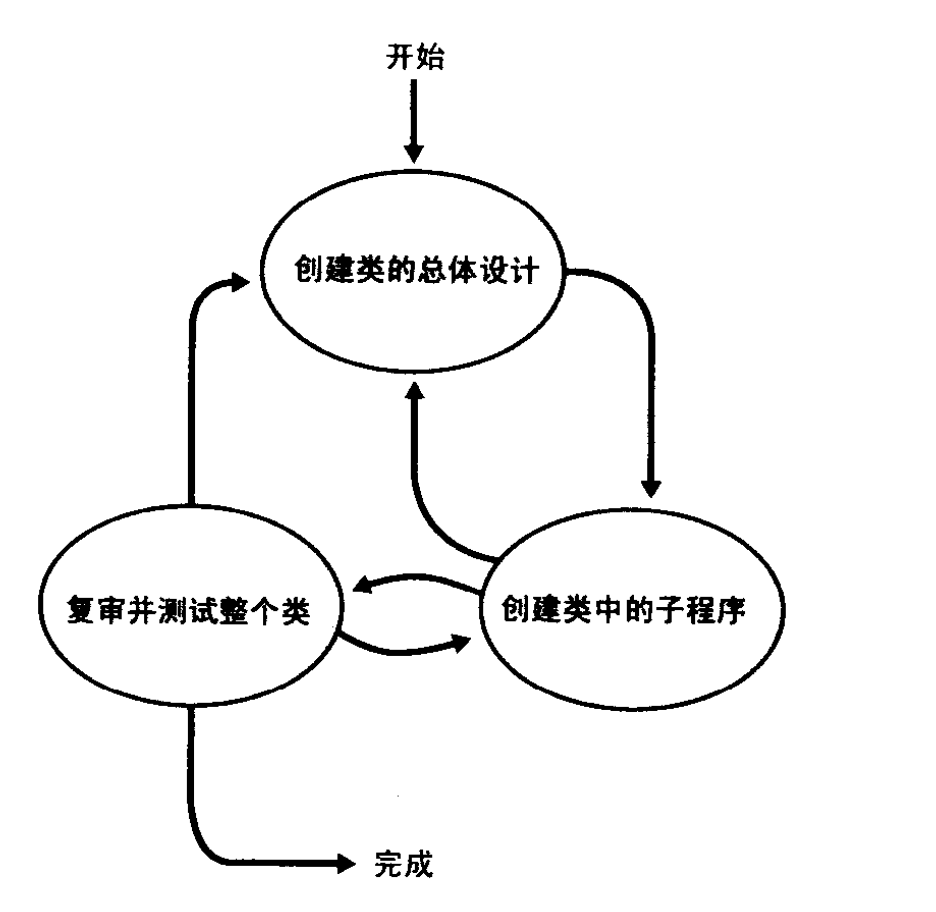
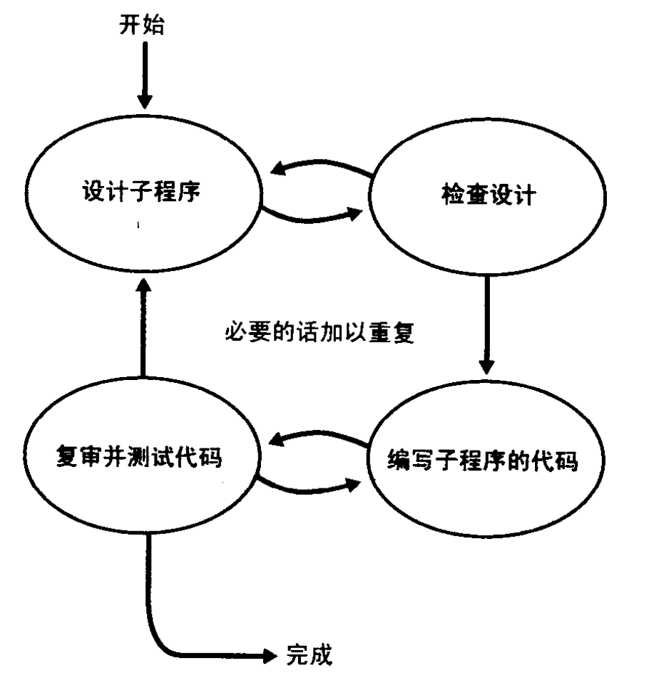
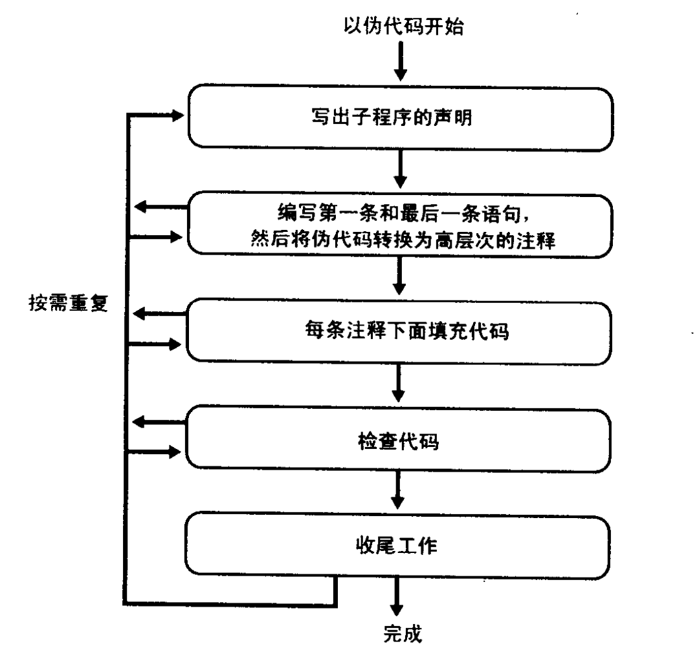

<h1 align="center">📔 Part II : Creating High-Quality Code 学习笔记</h1>

- [Chapter 05 软件构建中的设计](#chapter-05-软件构建中的设计)
  - [1. 设计中的挑战](#1-设计中的挑战)
  - [2. 关键的设计概念](#2-关键的设计概念)
    - [2.1 软件的首要技术任务：管理复杂度](#21-软件的首要技术任务管理复杂度)
    - [2.2 理想的设计特征](#22-理想的设计特征)
    - [2.3 设计的层次](#23-设计的层次)
  - [3. 设计构造块：启发式方法](#3-设计构造块启发式方法)
    - [3.1 启发式的几个方法](#31-启发式的几个方法)
      - [3.1.1. 找出现实世界中的对象](#311-找出现实世界中的对象)
      - [3.1.2 形成一致的抽象](#312-形成一致的抽象)
      - [3.1.3 封装实现细节](#313-封装实现细节)
      - [3.1.4 当继承能简化设计时就继承](#314-当继承能简化设计时就继承)
      - [3.1.5 隐藏秘密（信息隐藏）](#315-隐藏秘密信息隐藏)
      - [3.1.6 找出容易改变的区域](#316-找出容易改变的区域)
      - [3.1.7 保持松散耦合](#317-保持松散耦合)
      - [3.1.8 常用的设计模式](#318-常用的设计模式)
      - [3.1.9 其他的启发式方法](#319-其他的启发式方法)
    - [3.2 使用启发式方法的原则](#32-使用启发式方法的原则)
  - [4. 设计实践](#4-设计实践)
- [Chapter 06 可以工作的类](#chapter-06-可以工作的类)
  - [1. 类的基础：抽象数据类型](#1-类的基础抽象数据类型)
    - [1.1 使用ADT的好处](#11-使用adt的好处)
  - [2. 良好的类接口](#2-良好的类接口)
    - [2.1 好的抽象](#21-好的抽象)
    - [2.2 好的封装](#22-好的封装)
  - [3. 有关设计和实现的问题](#3-有关设计和实现的问题)
    - [3.1 包含（“有一个...”的关系）](#31-包含有一个的关系)
    - [3.2 继承（“是一个...”的关系）](#32-继承是一个的关系)
    - [3.3 使用继承还是包含的规则总结](#33-使用继承还是包含的规则总结)
    - [3.4 成员函数和数据成员](#34-成员函数和数据成员)
    - [3.5 构造函数](#35-构造函数)
  - [4. 创建类的原因](#4-创建类的原因)
  - [5. 应该避免的类](#5-应该避免的类)
  - [6. 与具体编程语言相关的问题](#6-与具体编程语言相关的问题)
  - [7. 超越类：包](#7-超越类包)
- [Chapter 07 高质量的子程序](#chapter-07-高质量的子程序)
  - [1. 创建子程序的正当理由](#1-创建子程序的正当理由)
  - [2. 在子程序上设计](#2-在子程序上设计)
  - [3. 好的子程序名字](#3-好的子程序名字)
  - [4. 子程序可以写多长？](#4-子程序可以写多长)
  - [5. 如何使用子程序参数？](#5-如何使用子程序参数)
  - [6. 使用函数时要特别考虑的问题](#6-使用函数时要特别考虑的问题)
    - [6.1 什么时候使用函数，什么时候使用过程？](#61-什么时候使用函数什么时候使用过程)
    - [6.2 设置函数的返回值](#62-设置函数的返回值)
  - [7. 宏子程序和内联子程序](#7-宏子程序和内联子程序)
    - [7.1 宏子程序在使用上的限制](#71-宏子程序在使用上的限制)
    - [7.2 内联子程序](#72-内联子程序)
  - [8. 核对表：高质量的子程序](#8-核对表高质量的子程序)
    - [8.1 大局事项](#81-大局事项)
    - [8.2 参数传递事宜](#82-参数传递事宜)
- [Chapter 08 防范式编程](#chapter-08-防范式编程)
  - [1. 保护程序免遭无效输入数据的破坏](#1-保护程序免遭无效输入数据的破坏)
  - [2. 断言](#2-断言)
    - [2.1 建立自己的断言机制](#21-建立自己的断言机制)
    - [2.2 使用断言的指导建议](#22-使用断言的指导建议)
  - [3. 错误处理技术](#3-错误处理技术)
    - [3.1 健壮性和正确性](#31-健壮性和正确性)
    - [3.2 高层次设计对错误处理方式的影响](#32-高层次设计对错误处理方式的影响)
  - [4. 异常](#4-异常)
  - [5. 隔离程序以免遭由错误造成的损害](#5-隔离程序以免遭由错误造成的损害)
  - [6. 辅助调试代码](#6-辅助调试代码)
  - [7. 确定在产品代码中该保留多少防范式代码](#7-确定在产品代码中该保留多少防范式代码)
  - [8. 对防范式编程时保持防范](#8-对防范式编程时保持防范)
  - [9. 核对表：防御式编程](#9-核对表防御式编程)
  - [10. 资料推荐](#10-资料推荐)
- [Chapter 09 伪代码编程过程](#chapter-09-伪代码编程过程)
  - [1. 创建类和子程序的步骤概述](#1-创建类和子程序的步骤概述)
    - [1.1 创建一个类的步骤](#11-创建一个类的步骤)
    - [1.2 创建子程序的步骤](#12-创建子程序的步骤)
  - [2. 伪代码](#2-伪代码)
  - [3. 通过伪代码编程过程创建子程序](#3-通过伪代码编程过程创建子程序)
    - [3.1 设计子程序](#31-设计子程序)
    - [3.2 编写子程序](#32-编写子程序)
    - [3.3 检查代码](#33-检查代码)
    - [3.4 收尾工作](#34-收尾工作)
  - [4. 伪代码编程过程之外的其它方案](#4-伪代码编程过程之外的其它方案)
  - [5. 核对表：伪代码编程过程](#5-核对表伪代码编程过程)


# Chapter 05 软件构建中的设计
一个好的类或者子程序的设计在很大程度上是由系统的架构所决定的。

## 1. 设计中的挑战

设计是把需求分析和编码调试连接在一起的活动。

- 设计是一个险恶的问题
  - 险恶问题的定义：只有通过解决或部分解决才能被明确的问题。

- 设计是个了无章法的过程（即使它能得出清爽的成果）
  - 软件设计的成果是组织良好、干净利落的。
  - 了无章法的原因
    - 在设计过程中，会采取了多种错误的步骤，多次误入歧途。
    - 难判断是否足够好

- 设计就是确定取舍和调整顺序的过程
  - 完美的程序并不存在。
  - 设计中的一个关键内容：去衡量彼此冲突的各项设计特性，并尽力在其中寻求平衡。

- 设计受到诸多限制
  - 设计的要点：
    - 一部分是在创造可能发生的事情
    - 另一部分是在限制可能发生的事情。

- 设计是不确定的

- 设计是一个启发式过程
  - 因不确定性，故设计技术也就具有探索性。
  - “经验法则” 或者 “试试没准能行的方法”，而不是保证能产生预期结果的可重复的过程。

- 设计是自然而然的过程
  - 设计不是在谁的头脑中跳出来的。是在不断地设计评估、非正式讨论、写试验代码以及修改试验代码中演化和完善的。


## 2. 关键的设计概念
好的设计源于对一小批关键设计概念的理解。

### 2.1 软件的首要技术任务：管理复杂度

- 偶然的难题和本质的难题
  - 本质的属性：一件事物必须具备、如果不具备就不再是该事物的属性。
  - 偶然的属性：一件事物碰巧具有的属性，有没有这些属性都并不影响这件事物本身。

- 管理复杂度的重要性
  - 当项目确由技术因素导致失败时，其原因通常就是失控的复杂度。
  - 尽量减少在任一实践所要考虑的程序量。
  - 在软件架构的层次上，可以通过把整个系统分解为多个子系统来降低问题的复杂度。
  - 保持子程序的短小精悍能帮助你减少思考的负担。
  - 要写出自己容易理解，也让别人容易看懂，而且很少有错误的程序代码。


- 如何应对复杂度
  - 高代价、低效率的设计来源于三种根源：
    - 用复杂的方法解决简单的问题。
    - 用简单但错误的方法解决复杂的问题。
    - 用不恰当的复杂方法解决复杂的问题。

  - 管理复杂度的两种方法：
    - 把任何人在同一时间需要处理的本质（essential）复杂度的量减到最少。
    - 不要让偶然性（accidental）的复杂度无谓地快速增长。

### 2.2 理想的设计特征

- 最小的复杂度（Minimal complexity）
  - 做出简单易于理解的设计，而不是做出 “聪明” 的设计。

- 易于维护（Ease of maintenance）
  - 在设计时要为维护工作考虑。

- 松散耦合（loose coupling）
  - 设计时让程序的各个组成部分之间关联最小。

- 可扩展性（extensibility）
  - 可增强系统的功能而无须破坏其底层结构。

- 可重用性（reusability）
  - 系统的组成部分能在其它系统中重复使用。

- 高扇入（high fan-in）
  - 让大量的类使用某个给定的类。

- 低扇出（low fan-out）
  - 让一个类里少量或适中地使用其他的类。

- 可移植性（portability）
  - 方便移植到其它平台或者环境中。

- 精简性（leanness）
  - 设计出的系统没有多余的部分。
  - 要考虑到向后兼容性。

- 层次性（stratification）
  - 尽量保持系统各个分解层的层次性。
  - 可以通过观察层次即可，而不是深入到其它层次。

- 标准技术（Standard techniques）
  - 尽量用标准化、常用的方法。


### 2.3 设计的层次
一个软件系统的设计层次，可以通过自顶向下的设计方法，通过宏观，从而进一步细化成多个子层次：
- 软件系统
  - 整个系统
- 分解为子系统或包
  - 该层次主要是识别出所有的主要子系统。
  - 此时主要的活动是：确定如何把程序分为主要的子系统，并定义清楚允许给子系统如何使用其他子系统。
  - 注意不同子系统之间相互通信的规则。
  - 为了让子系统之间的连接简单易懂且易于维护，要尽量简化子系统之间的交互关系。

- 分解为类
  - 该层次的设计包括识别出系统中所有的类。
  - 此时的主要设计任务：把所有的子系统进行适当的分解，并确保分解出的细节可以用单个的类来实现。
  - 对象和类的比较：
    - 对象：运行期间在程序中实际存在的具体实体。
    - 类：在程序源码中存在的静态事物。

- 分解为子程序
  - 该层的设计是把每个类细分为子程序。
  - 在做分解类时，做了一部分的子程序，此时就需要将细化出类的私用子程序。
  - 完整地3定义出类内部的子程序，有助于更好地理解类的接口。

- 子程序内部的设计
  - 为每个子程序布置详细的功能。

## 3. 设计构造块：启发式方法
软件设计是非确定性的，所以就需要灵活运用一些有效的启发式方法，便成了合理的软件设计的核心工作。
### 3.1 启发式的几个方法

#### 3.1.1. 找出现实世界中的对象
- 在确定设计方案时，首选使用的是 “常规的”面向对象设计方法。该方法的要点是辨识现实世界中的对象（object，物体）以及人造（synthetic）对象。
- 使用对象进行设计的步骤：
  - 辨识对象及其属性（方法（Method）和数据（data））。
    - 计算机程序通常是基于现实世界的实体。
    - 辨识对象的属性并不比辨识对象本身更困难。每个对象都有一些与计算机程序相关的特征。

  - 确定可以对各个对象进行的操作
    - 在每个对象之上都可以执行多种操作。

  - 确定各个对象能对其他对象进行的操作。
    - 对象之间最常见的两种关系：包含（containment）和继承（inheritance）。

  - 确定对象的那些部分对其他对象可见 --- 哪些部分可以是公用（public）的，哪些部分应该是私用（private）的。

  - 定义每个对象的公开接口（public interface）。
    - 在编程语言的层次上为每个对象定义具有正式语法的接口。
    - 对象对其他`对象暴露`的`数据`及`方法`都被称为该对象的 **`“公开接口/public interface”`**。
    - 对象通过`继承关系`向其`派生对象`暴露的部分则称为 **`“受保护的接口/protected interface”`**。

两种迭代方法：
- 在高层次的系统组织结构上进行迭代，以便于更好地组织类的结构。
- 在每一个已经定义的类上进行迭代，把每个类的设计细化。

#### 3.1.2 形成一致的抽象
- 抽象可以让你在关注某一概念的同时可以放心地忽略其中一些细节的能力（在不同的层次处理不同的细节）。
- 基类也是一种抽象，能集中精力关注一组派生类具有的共同特性，并在基类的层次上忽略各个具体派生类的细节。

- 从复杂角度来说，抽象的主要好处：使你忽略无关的细节。

#### 3.1.3 封装实现细节
- 封装填补了抽象留下的空白。
- 封装就是将复杂的东西进行隐藏。

#### 3.1.4 当继承能简化设计时就继承
- 定义对象之间的相同点和不同点的部分就叫 “继承”。

- 继承的作用：更好地辅助抽象的概念。抽象是从不同的细节层次来看对象的。

- 继承可以简化编程的工作，但是继承是一把双刃剑，使用得当，能带来极大的益。如果使用不当，则有极大的弊端。

#### 3.1.5 隐藏秘密（信息隐藏）
- 信息隐藏是结构化程序设计与面向对象设计的基础之一。结构化设计里的“黑盒子”概念就是来源于信息隐藏。
  - 面向对象设计中，引出封装和模块化的概念，并与抽象的概念密切相关。
  - 信息隐藏是软件开发中一个开拓性的概念。

- 软件开发者将设计和实现决策隐藏，使得程序的其他部分看不到。

- 信息隐藏是软件的首要技术使命中格外重要的一种启发式方法。
  - 主要强调了隐藏复杂度。

- 当信息被隐藏后，每个类（或者包和子程序）都代表了某种对其他类保密的设计或者构建决策。

- 隐藏起来的秘密可能是某个易变的区域，或者某种文件格式或者某种数据类型的实现方式。

#### 3.1.6 找出容易改变的区域
- 好的程序设计所面临的最重要挑战之一：适应变化。
  - 将不稳定的区域隔离出来，从而将变化所带来的影响限制在一个子程序类或者包的内部。

对于变动来说，可以采取的一些措施：
- 找出看起来容易变化的项目。
  - 从需求中找出潜在的可能性。

- 把容易变化的项目分离出来。
  - 找出容易变化的组件单独划分成类，或者将同时变化的组件划分到同一个类中。

- 把看起来容易变化的项目隔离开来。
  - 设计好类的接口，把变化限制在类的内部，且不会影响类的外部。
  - 类的接口应该肩负起保护类的隐私的职责。

容易发生变化的区域：
- 业务规则
- 对硬件的依赖性。
- 输入和输出。
- 困难的设计区域和构建区域。
- 状态变量。
- 数据量的限制。


#### 3.1.7 保持松散耦合
**`耦合度`**：表示类与类之间或者子程序与子程序之间关系的紧密程度。

耦合度设计的目标是创建小的、直接的、清晰的类或者子程序，使得与其他类或子程序之间关系尽可能灵活。

模块之间好的耦合关系会松散到恰好能使一个模块能够很容易被其他模块使用。

在软件中，确保模块之间的连接关系尽可能地简单。也尽量使创建的模块不依赖或者很少依赖其他模块。

- 衡量模块之间耦合度时可采用的标准
  - 规模
    - 模块之间的连接数。

  - 可见性
    - 两个模块之间的连接的显著程度。

  - 灵活性
    - 模块之间的连接是否容易改动。

- 常见的几种耦合种类
  - 简单数据参数耦合
    - 当两个模块之间泰国参数来传递数据，且所有的数据都是简单数据类型时。这种耦合关系是正常的，也可接受。

  - 简单对象耦合
    - 一个模块实例化一个对象。
  
  - 对象参数耦合
    - 参数传递的是一个对象。和简单数据类型相比，耦合关系更紧密。

  - 语义上的耦合
    - 一个模块不仅使用了另一个模块的语法元素，还使用了有关模块内部工作细节的语义知识。
    - 尽量避免这种耦合方式，因为更改被调用的模块中的代码可能会破坏掉用它的模块。破坏的方式编译器会无法检查。


#### 3.1.8 常用的设计模式
设计模式的好处：
- 设计模式通过提供现成的抽象来减少复杂度。

- 设计模式通过常见解决方案的细节予以制度化来减少出错。

- 设计模式通过提供多种设计方法而带来启发式的价值。

- 设计模式通过把设计对话提升到一个更高的层次上简化交流。

常见的设计模式：
|模式|描述|
|--|--|
|Abstract Factory（抽象工厂）|通过指定对象组的种类而非单个对象的类型来支持创建一组相关的对象|
|Adapter（适配器）|把一个类的接口转变为另一个接口|
|Bridge（桥接）|把接口和实现分开，使他们可以独立地变化。|
|Composite（组合）|创建一个包含其他同类对象的对象，使得客户代码可以与最上层对象交互而无须考虑所有的细节对象。|
|Facade（外观）|为没有提供一致接口的代码提供一个一致的接口|
|Factory Method|做特定基类的派生类的实例化时，除了在Factory Method内部之外均无须了解各派生类对象的具体类型|
|Iterator（迭代器）|提供一个服务对象来顺序地访问一组元素中的各个元素|
|ObServer（观察者）|使一组相关对象相互同步，方法是让另一个对象负责，在这组对象中的任何一个发生改变时，由它把这种变化通知给这个组里的所有对象|
|Singleton（单例）|为有且仅有一个实例的类提供一种全局访问功能|
|Strategy（策略）|定义一组算法或者行为，使得它们可以动态地相互替换|
|Template Method（模板方法）|定义一个操作的算法结构，但是把部分实现的细节留给子类（派生类）|

应用模式存在的两个陷阱：
- 强迫让代码适用于某个模式。
- “为了模式而模式”。

推荐资源：https://refactoringguru.cn/design-patterns/catalog

#### 3.1.9 其他的启发式方法
不太常用，但值得一试的一些启发式方法：
- 高内聚性
  - 内聚性指的是类内部的子程序或者子程序内的所有代码都支持一个中心目标上的紧密程度（类的目标是否集中）。

- 构造分层结构
  - 在软件中分层结构中，最通用的或者最抽象的概念表示位于层次关系的最上面，而更加详细的具有特定意义的概念则放在更低的层次中。

- 严格描述类契约
  - 把类的结偶看作是程序的其余部分之间的一项契约并有助于更好地洞察程序。

- 分配职责
  - 为对象分配职责。

- 为测试而设计

- 避免失误

- 有意识地选择绑定时间
  - 指的是把特定的值绑定到某一个变量的时间。

- 创建中央控制点
  - 唯一一个正确位置的准则（对于每一段有作用的代码，都应该只有唯一的地方可见，并只能在一个正确的位置去做可能的维护性修改）。

- 考虑使用蛮力突破
- 画一个图
- 保持设计的模块化
  - 模块化的目标：使每个子程序或者类看似黑盒。
  - 黑盒的接口设计和定义明确的功能，对于给定任何特定的输入，都可以准确预期对应的输出结果。

### 3.2 使用启发式方法的原则
G.Polya 在数学领域发展的一套解决问题的方法，它同样适用于解决软件设计中的问题。

- 必须理解问题
- 设计一个计划，找出现有的数据和未知量之间的联系。
- 执行计划。
- 回顾，并检视整个的解。

最有效的原则之一：不要卡在单一的方法上，也无须马上解决整个设计难题。

## 4. 设计实践

- 迭代
- 分而治之
  - 参考Polya在数学问题中所建议的方法来进行增量式地改进。

- 自上而下和自下而上的设计方法
  - 自上而下：从某个高的抽象层次开始（分解策略）。
  - 自下而上：始于细节，并向一般性延伸（合成策略）。

- 建立试验性原型
  - 写出用于回答特定设计问题的、量最少且能够随时扔掉代码的活动。
- 合作设计
- 记录你的设计成果


# Chapter 06 可以工作的类
成为高效程序员的一个关键：开发程序任一部分代码时，都能安全地忽略程序中尽可能多的其余部分。

## 1. 类的基础：抽象数据类型
**`抽象数据类型（Abstract Data Types（ADTs））`**：指一些数据以及对这些数据进行操作的集合。

### 1.1 使用ADT的好处
- 可以隐藏实现细节
- 改动不影响到整个程序
- 让接口能提供更多信息
- 更容易提高性能
- 让程序的正确性更显而易见
- 程序更具有自我说明性
- 无须在程序内部到处传递数据
- 可以像在现实世界中那样操作实体，而不用在底层实现上操作它。

## 2. 良好的类接口
创建高质量类的第一步，也可能是最重要的一步：创建一个好的接口。

- 抽象通过提供一个可以让你忽略实现细节的模型来管理复杂度。
- 封装则强制阻止看到细节。

### 2.1 好的抽象
- 对类的抽象进行评估的方法：基于类所具有的公用（public）子程序所构成的集合（类的接口）。

- 一些创建类的抽象接口的指导建议：
  - 类的接口应该展现一致的抽象层次
    - 把类当作一种用来实现抽象数据类型的机制。
    - 每一个类应该实现一个ADT，并且仅实现这个ADT。

  - 一定要理解类所实现的抽象是什么
  - 提供成对的服务
    - 大多数都有和它其相对应的、相等的以及相反的操作。
    - 不要盲目创建相反的操作，而是应该考虑是否需要。

  - 把不相关的信息转移到其他类中
  - 尽可能让接口可编程，而不是表达语义
    - 每个接口都由一个可编程的部分和一个语义部分组成。
      - 可编程部分：由接口中的数据类型和其他属性构成。
        - 编译器会强制要求（在编译时检查错误）。
      - 语义部分：由“本接口将会怎样被使用”的假定组成（依赖关系，使用A之前需要调用B）。
        - 编译器无法强制检查。

  - 谨防在修改时破坏接口的抽象
  - 不要添加与接口愁绪不一致的公用成员
    - 每次向类的接口中添加子程序时，尽量去保证抽象的完整性。

  - 同时考虑抽象性和内聚性
    - 一个好的抽象的类接口同时也有很高的内聚性。
  
关注类的接口所表现出来的抽象，比关注类的内聚性更有助于深入理解类的设计。

### 2.2 好的封装
- “设计精良的模块和设计糟糕的模块的唯一最大区别，就是对其他模块隐藏本模块内部数据和其他实现细节的程度。” ——Joshua Bloch。

- 关于类的封装接口的一些指导建议：
  - 尽可能地限制类和成员的可访问性
    - 采用最严格且可行的访问级别设置（public、private、protected）。
    - 如果不确定，多隐藏也比少隐藏好。

  - 不要公开暴露成员数据
    - 暴露成员数据会破坏封装性，从而限制对抽象的控制能力。

  - 避免把私用的实现细节放入类的接口中
  - 不要对类的使用者做出任何假设
  - 避免使用友元类
  - 不要因为一个子程序里仅使用公用子程序，就把它归入公开接口。
  - 让阅读代码比编写代码更加方便
  - 要格外警惕从语义上破坏封装性
    - 让调用方代码不是依赖类的公开接口，而是依赖类的私用实现。
  - 留意过于紧密的耦合关系
    - 两个类之间关联的紧密程度。
    - 关联越松越好。
    - 关于耦合的指导建议：
      - 尽可能限制类和成员的可访问性。
      - 避免友元类，因为是紧密耦合。
      - 在基类中把数据声明为private而不是prtected，以降低派生类和基类之间耦合的程度。
      - 避免在类的公开接口中暴露成员数据。
      - 要对语义上破坏封装性保持警惕。
      - 察觉“Demeter（得墨特耳）”法则。

## 3. 有关设计和实现的问题
给类定义合理的借口，对于创建高质量程序起到了关键作用。

### 3.1 包含（“有一个...”的关系）
包含表示一个类含有一个基本数据元素或对象。相比继承，包含是面向对象编程中的主力技术。

- 通过包含来实现 “有一个/has a” 的关系
- 在万不得已时通过private继承来实现 “有一个” 的关系
- 警惕有超过约7个数据成员的类


### 3.2 继承（“是一个...”的关系）
继承：一个类是另一个类的一种特化（specialization）。

继承的目的：通过“定义能为两个或者更多派生类提供共有元素的基类”的方式写出更精简的代码。

继承的好处：有助于避免在多处出现重复的代码和数据。

当使用继承时，需要考虑的注意事项：
- 用public 继承来实现 “是一个...” 的关系
- 要么使用继承并进行详细说明，要么不使用
- 遵循Liskov替换原则（Liskov Substitution Principle, LSP）
- 确保只继承需要继承的部分
- 不要 “覆盖” 一个不可覆盖的成员函数。
- 把共有的接口、数据及操作放到继承树中尽可能高的位置
- 只有一个实例的类是值得怀疑的。
- 只有一个派生类的基类也值得怀疑。
- 派生后覆盖了某个子程序，但在其中没做任何操作，这种情况也值得怀疑。
- 避免让继承体系过深
- 尽量使用多态、避免大量的类型检查。
- 让所有数据都是private（而非protected）。

### 3.3 使用继承还是包含的规则总结
- 如果多个类共享数据而非行为，则创建这些类可以包含的共用对象。
- 如果多个类共享数据而非行为，则让它们从共同的基类继承而来，并在基类里定义共用的子程序。
- 如果多个类既共享数据也共享行为，则从一个共同的基类继承而来，并在基类里定义共用的数据和子程序。
- 想由基类控制接口时，使用继承，想自己控制接口，则使用包含。

### 3.4 成员函数和数据成员
对于实现成员函数和数据成员的一些指导建议：
- 让类中子程序的数量尽可能少
- 禁止隐式地产生你不需要的成员函数和运算符
- 减少类所调用的不同子程序的数量
- 对其他类的子程序的间接调用要尽可能少
- 一般来说，应尽量减小类和类之间相互合作的范围
  - 尽量减少以下的数字到最小：
    - 所实例化的对象的种类
    - 在被实例化对象上直接调用的不同子程序的数量
    - 调用其他对象返回的对象的子程序的数量。

### 3.5 构造函数
对于构造函数的指导建议：
- 如果可能，应该在所有的构造函数中初始化所有的数据成员。
  - 做到防御式编程。
- 用私用构造函数来强调实现单例属性

- 优先采用深层拷贝，除非论证可行，才采用浅层拷贝。
  - 深拷贝：对象成员数据逐项复制的结果。
  - 浅拷贝：只是指向或引用同一个实际对象。

## 4. 创建类的原因
- 为现实世界中男的对象建模
- 为抽象的对象建模
- 降低复杂度
- 隔离复杂度
- 隐藏实现细节
- 限制变动的影响范围
- 隐藏全局数据
- 让参数传递更顺畅
- 建立中心控制点
- 让代码更易于重用
- 为程序族做计划
- 把相关操作包装到一起
- 实现某种特定重构

## 5. 应该避免的类
- 避免创建万能类
- 消除无关紧要的类
- 避免用动词命名的类

## 6. 与具体编程语言相关的问题
不同语言之间和类相关的存在差异的地方：
- 在继承层次中被覆盖的构造函数和析构函数的行为。
- 在异常处理时构造函数和析构函数的行为。
- 默认构造函数（即无参数的构造函数）的重要性。
- 析构函数或者终结器（finalizer）的调用时机。
- 和覆盖语言内置的运算符（包括赋值和等号）相关的知识。
- 当对象被创建和销毁时，或当其被声明时，或者它所在的作用域退出时，处理内存的方式。


## 7. 超越类：包
类是当前程序员们实现模块化的最佳方式。

为了更好地使用封装和抽象，一些编程语言也引入了包的概念，对于包的则遵循对应的编程标准：
- 用于区分 “公用的类” 和 “某个包私用的类” 的命名规则。
- 为了区分每个类所属的包而制定的命名规则或代码组织规则（即项目结构）。
- 规定什么包可以用其他什么包的规则，包括是否可以用继承和包含等。

# Chapter 07 高质量的子程序
**`子程序`** 是为实现一个特定的目的而编写的一个可被调用的方法或者过程。

## 1. 创建子程序的正当理由
- 降低复杂度
  - 当内部循环和条件判断的嵌套层次很深时，则需要从子程序中提取出新的子程序，从而降低外围子程序的复杂度。

- 引入中间、易懂的抽象
  - 将代码重新组织，并引入一个新的抽象名，使代码更易于理解。

- 避免代码重复
  - 将共同的放入基类，将差异部分放入派生类中。
  - 减少重复代码出现的次数，可以节约空间，并且改动或者验证方便。

- 支持子类化
- 隐藏顺序
- 隐藏指针操作
  - 指针可读性差，容易出错。
- 提高可移植性
- 简化复杂的布尔判断
- 改善性能
  - 把代码集中一处，后续使用更高效的算法或者语言来重写时很容易。

- 确保所有的子程序都很小

此外，创建类的很多理由也是创建子程序的理由。
- 隔离复杂性
- 隐藏实现细节
- 限制变化带来的影响
- 隐藏全局数据
- 形成中央控制点
- 促成可重用的代码
- 达到特定的重构目的

编写有效的子程序时，一个最大的心理障碍是不情愿为一个简单的目的而编写一个简单子程序。小的子程序能提高可读性，并容易扩展。
## 2. 在子程序上设计
- 在类的设计上，抽象和封装在类层次上已经很大程度上取代了内聚性。但在单个子程序层次上，仍然是设计时常用的启发式方法。

- 对子程序来说，内聚性是指子程序中各种操作之间联系的紧密程度。目标是让每个子程序只把一件事情做好，不做任何其他的事情。

关于内聚性的可采用的几个层次讨论：
- 功能的内聚性
  - 最强也是最好的一种内聚性。即让一个子程序仅执行一项操作。
- 顺序上的内聚性
  - 指在子程序内包含有需要按特定顺序执行的操作，这些步骤需要共享数据，并在全部执行完毕后才可以完成整个功能。
- 通信上的内聚性
  - 指一个子程序中的不同操作使用了同样的数据，但不去存在其他任何联系。
  - 优化方式：将子程序拆分分解成多个子程序。

- 临时的内聚性
  - 指含有一些需要同时执行才放到一起操作的子程序。
  - 优化方式：
    - 把临时性的子程序看作是一系列事件的组织者。要想让它生效，则使用原临时性内聚的子程序去调用其他的子程序。即让子程序来完成特定的操作，而不是由它直接执行所有的操作。

除了功能的内聚性外，其它类型的内聚性不可取，尽量想办法避免，不可采用的几个内聚性：
原因：会导致代码组织混乱、难于调试、不便修改。
- 过程上的内聚性
  - 指一个子程序中的操作是按特定的顺序进行的。
- 逻辑上的内聚性
  - 若干个操作被放入到同一个子程序中，通过传入的控制标志选择执行其中一项操作。

- 巧合的内聚性
  - 子程序中的各个操作之间没有任何可以看到的关联。有时也叫做“无内聚性” 或者 “混乱的内聚性”。

## 3. 好的子程序名字
好的子程序名字能清晰地描述子程序所做的一切。

- 描述子程序所做的所有事情
  - 子程序的名字应当描述其所有的输出结果以及副作用。

- 避免使用无意义的、模糊或表述不清的动词

- 不要仅仅通过数字来形成不同的子程序
- 根据需要确定子程序名字的长度
- 给函数命名时要对返回值有所描述
  - 对于函数有返回值时，要对函数的命名应该针对其返回值进行。
- 给过程起名时要使用语气强烈的动词加宾语的形式
- 准确使用对仗词
  - 命名遵守对仗词的贵贼有助于保持一致性和提高可读性。

- 为常用操作确立命名规则

## 4. 子程序可以写多长？
- 理论上认为的子程序最佳最大长度通常是一屏代码或打印出来一到两页的1代码，差不多约50 ～ 150行代码左右。

- 但是每家公司的标准不一致。目前遇到过的公司很多都是50～100之间。所以选择最合适的长度规则即可。

- 当一个子程序的编写超过200行，此时需要注意代码的出错率。可能会使得代码的可读性下降，也会导致迭代维护的代价成本上升。

对于如何决定子程序的长度，可以参考几个角度来进行考虑：
- 子程序的内聚性
- 嵌套的层次
- 变量的数量
- 决策点的数量
- 解释子程序用意所需的注释数量
- 与复杂度相关的考虑事项

## 5. 如何使用子程序参数？
在程序中有很多错误是内部接口错误（主要集中在子程序之间相互通信时发生的错误）。所以可参考减少接口错误的指导原则：
- 按照输入 -- 修改 -- 输出的顺序排列参数
  - 不要随机地或者按字母顺序排列参数，应该先列出仅作为输入用途的，然后是既作为输入又作为输出用途，最后才是仅作为输出用途。

- 考虑自己创建in 和 out 关键字
  - 存在两个弊端：
    - 自定义的IN和OUT关键字扩展了C++，某种程度上让阅读者感到生疏，也就是存在可读性的问题。
    - 编译器不会强制检查IN和OUT关键字的使用。


- 如果几个子程序都用了类似的一些参数，应该让这些参数的排列顺序保持一致。
  - 子程序的参数顺序可以产生记忆效应，不一致的顺序会让参数难以记忆。
- 使用所有的参数
  - 参数的使用，一定要全，如果不使用，那么就在子程序中的接口中删除。

- 把状态或出错变量放在最后

- 不要把子程序的参数用作工作变量
  - 引入局部工作变量去接收参数值。

- 在接口中对参数的假定加以说明
  - 注释说明参数的意义。

- 把子程序的参数个数限制在大约7个以内
  - 子程序中参数的个数的多少，取决于编程语言如何支持复杂的数据类型。

- 考虑对参数采用某种表示输入、修改、输出的命名规则
- 为子程序传递用以维持其接口抽象的变量或对象
- 使用具名参数
  - 显式地把形式参数和实际参数对应，避免以为用错参数带来的错误。

- 确保实际参数与形式参数相匹配
  - 总要检查参数表中参数的类型，同时留意编译器给出的关于参数类型不匹配的警告。

## 6. 使用函数时要特别考虑的问题
- 函数：有返回值的子程序。
- 过程：没有返回值的子程序。

函数与过程的区别更多的是语义的区别，而不是语法的区别。
### 6.1 什么时候使用函数，什么时候使用过程？
- 让函数像过程一样执行并返回状态值。

- 如果一个子程序的主要用途就是返回由其名字所指明的返回值，那么就应该使用函数，否则就应该使用过程。

### 6.2 设置函数的返回值
使用函数时总存在返回不正确的返回值的风险。所以为了减少该风险，给出了两个建议：
- 检查所有可能的返回路径。
- 不要返回指向局部数据的引用或指针。

## 7. 宏子程序和内联子程序
用预处理器的宏语言编写子程序还需要一些特别的考虑。
- 把宏表达式整个包含在括号内。
  ```c
  // 不能正确展开的宏
  #define Cube(a) a*a*a // 如果是表达式 Cube(x+1)，所以会展开成 x+1*x+1*x+1，此时计算的优先级已改变。

  #define Cube01 (a)*(a)*(a) // 会出现比乘法优先级更高的运算符
  ```
- 把含有多条语句的宏用大括号括起来。
  ```c
  // 可正常展开的宏
  #define Cube02(a) ((a)*(a)*(a))
  ```
- 用给子程序命名的方法来给展开后代码形同子程序的宏命名，以便于需要时可以用子程序来替换宏。
  - C++语言中给宏命名的方式是使用全部大写字母。
  - 如果能用子程序去代替宏，那在给宏命名时就应该采用子程序命名的规则。

对于宏代替函数的做法具有风险。除非必要，否则还是应该避免使用这种方式。

### 7.1 宏子程序在使用上的限制
正如C++之父Bjarne Stroustrup所指出的：几乎每个宏都表明在编程语言、程序或者程序员身上存在问题，但当你使用宏时，就别指望调试器、编译器、交叉引用工具和profiler等工具可以好好工作。除非万不得已，否则就不应该使用宏来代替子程序。

### 7.2 内联子程序
C++支持inline关键字，inline子程序的代码，可以避免子程序调用产生的开销，可以产生非常高效的代码。

- 节制使用inline子程序
  - 原因：违反了封装原则，暴露所有实现细节给所有使用头文件的程序员。

inline子程序要求在调用子程序的每个位置都生成该子程序的全部代码。此时无论inline长还是短，都会增加整体代码的长度。

## 8. 核对表：高质量的子程序

### 8.1 大局事项
- 创建子程序的理由充分吗？
- 一个子程序中所有适于单独提出的部分是不是已经被提出到单独的子程序中了？
- 过程的名字中是否使用了强烈、清晰的“动词+宾语”词组？函数的名字是否描述其返回值？
- 子程序的名字是否描述了它所做的全部事情？
- 是否给常用的操作建立了命名规则？
- 子程序是否具有强烈的功能上的内聚性？
- 子程序之间是否有较松的耦合？
- 子程序的长度是否由其功能和逻辑自然决定，而非遵循任何人为的编码标准？
### 8.2 参数传递事宜
- 整体来看，子程序的参数表是否表现出一种具有整体性且一致的接口抽象？
- 子程序参数的排列顺序是否合理？是否与类似的子程序的参数排列顺序相符？
- 接口假定是否已在文档中说明？
- 子程序的参数个数是否没超过7个？
- 是否用到了每一个输入参数？
- 是否用到了每一个输出参数？
- 子程序是否避免了把输入参数用作工作变量？
- 如果子程序是一个函数，那么它是否在所有可能的情况下都能返回一个合法的值？

# Chapter 08 防范式编程
防御式编程的主要思想：子程序应该不因传入错误数据而被破坏，哪怕是由其它子程序产生的错误数据。更一般地说，其核心思想是要承认程序会有问题，都需要被修改，聪明的程序员应该根据这一点来编程序。

## 1. 保护程序免遭无效输入数据的破坏
通常有三种方法来处理输入垃圾的情况：
- 检查所有来源于外部的数据的值。
- 检查子程序所有输入参数的值。
- 决定如何处理错误的输入数据。

防御式编程的最佳方式：在一开始不要在代码中引入错误。

## 2. 断言
**`断言（assertion）`** 是指在开发期间使用的、让程序在运行时进行自检的代码（通常是一个子程序或者宏）。
- 断言为真，则表明程序运行正常。
- 断言为假，则意味着代码中发现了意料之外的错误。

一个断言通常是含有两个参数：
- 一个描述假设为真时的情况的布尔表达式。
- 一个断言为假时需要显示的信息。

断言主要用于开发和维护阶段，在成品代码中并不会编译进去。

### 2.1 建立自己的断言机制
基本上很多语言都支持断言机制，如果不支持，也可以建立自己的断言机制。例如：C++宏改进的ASSERT实现：

```cpp
#define ASSERT(condition, message) { \
    if (condition) { \
        LogError("Assertion failed : ", #condition, message); \
        exit(EXIT_FAILURE);\
    }\
}
```

### 2.2 使用断言的指导建议
- 用错误处理代码来处理预期会发生的状况，用断言来处理决不应该发生的状况。
  - 断言：检查永远不可能发生的情况
  - 错误处理代码：检查不太可能经常出现的非正常情况。

- 避免把需要执行的代码放到断言中
- 用断言来注解并验证前条件和后条件
  - 前条件：子程序或者类的调用方代码在调用子程序或者实例化对象之前要确保为真的属性。
  - 后条件：子程序或类在执行结束后要确保为真的属性。

- 对于高健壮性的代码，应该先使用断言再处理错误
  - 不会同时使用二者，主张使用一种处理方法即可。

## 3. 错误处理技术
断言可以处理代码中不应该发生的错误。但又该如何处理那些预料中可能发生的错误呢？可以参考如下一些技术：
- 返回中立值。
  - 处理错误数据的最佳做法：继续执行操作并简单返回一个没有危害的数据。

- 换用下一个正确数据
- 返回与前次相同的值
- 换用最接近的有效值
- 在日志文件中记录警告信息
  - 日志中打印错误警告信息，并继续执行。
- 返回一个错误码

- 调用错误处理子程序或对象
  - 将错误处理都集中到一个全局的子程序或对象中。
- 当错误发生时显示出错信息
  - 该方法可减少错误处理的开销。
- 用最妥当的方式在局部处理错误
  - 该方法无法满足系统的整体性。

- 关闭程序


### 3.1 健壮性和正确性
处理错误最恰当的方式要根据出现错误的软件的类别而定。

- 正确性：永不返回不准确的结果。
- 健壮性：意味着要不断尝试采取某些措施，以保证软件可以持续地运转下去，哪怕有时做出一些不够准确的结果。

### 3.2 高层次设计对错误处理方式的影响

应该在整个程序中采用一致的方式处理非法的参数。

确定某一种方法，然后确保始终如一贯彻该方法。如果决定让高层的代码来处理错误，而底层的代码只需要简单处理报告错误，那么就要确保高层的代码确实处理了错误。


## 4. 异常
**`异常`**：就是把代码中的错误或异常事件传递给调用方代码的一种特殊手段。

异常和继承的相同点就是：审胜明智地使用时，都可以降低复杂度，但草率使用，只会让代码几乎无法理解。所以给出一些使用异常的指导建议来避免一些问题：
- 用异常通知程序的其他部分，发生了不可忽略的错误
- 只在真正例外的情况下才抛出异常
- 不能用异常来推卸责任。
  - 可在局部处理时，不能将它当作未被捕获的异常抛出去。

- 避免在构造函数和析构函数中抛出异常，除非你在同一个地方把它们捕获。
- 在恰当的抽象层次抛出异常
- 在异常消息中加入导致异常发生的全部信息
- 避免使用空的catch语句
- 了解所用函数库可能抛出的异常
- 考虑创建一个集中的异常报告机制
  - 确保异常处理的一致性。
- 把项目中对异常的使用标准化

- 考虑异常的替换方案。

## 5. 隔离程序以免遭由错误造成的损害
隔离（barricade）是一种容损策略。

- 以防御式编程为目的而进行隔离的一种方法，是把某些接口选定为 “安全” 区域的边界。对穿越安全区域边界的数据进行合法性校验，并当数据非法时做出敏锐的反映。

- 让软件的某些部分处理 “不干净的” 数据，而让另一部分处理 “干净的” 数据，可让大部分代码无须再负担检查错误数据的职责。

## 6. 辅助调试代码
防御式编程的另一个重要方面是使用调试助手（辅助调试的代码），调试助手可以帮助快速地检测错误。

- 不要自动地把产品版的限制强加于开发版之上
- 尽早引入辅助调试的代码
  - 越早引入辅助调试的代码，能够提供的帮助也越大。
- 采用进攻式编程
  - 开发阶段让异常情况显现，在产品代码运行时让它能够自我恢复，把该方式称为 “进攻式编程”。
  - 进行进攻式编程的一些方法：
    - 确保断言语句使程序终止运行。
    - 完全填充分配到的所有文件或流。
    - 完全填充分配到的所有内存。
    - 确保每一个case语句中的default分支或else分之都能产生严重错误，或者至少不让错误不会被忽视。
    - 在删除一个对象之前把它填满垃圾数据。
    - 让程序把它的错误日志文件用电子邮件发送给你。

- 计划移除调试辅助的代码
  - 使用类似ant和make等版本控制工具和make工具。
  - 使用内置的预处理器。
  - 编写自己的预处理器
  - 使用调试存根

## 7. 确定在产品代码中该保留多少防范式代码
对于防御式编程的一些指导建议：
- 保留那些检查重要错误的代码
- 去掉检查细微错误的代码
- 去掉可以导致程序硬性崩溃的代码
- 保留可以让程序稳妥地崩溃的代码
- 为技术支持人员记录错误信息
- 确认留在代码中的错误消息是友好的。

## 8. 对防范式编程时保持防范
过度的防御式编程也会引起问题。会导致程序变得臃肿和缓慢，引入的额外代码会增加软件的复杂度。

对于何时进行防御，应该因地制宜地调整你进行防御式编程的优先级。

## 9. 核对表：防御式编程
- 一般事宜
  - 子程序是否保护自己免遭有害数据的破坏？
  - 你用断言来说明编程假定吗？其中包括了前条件和后条件吗？
  - 断言是否只是用来说明从不应该发生的情况？
  - 你是否在架构或高层设计重规定了一组特定的错误处理技术？
  - 你是否在架构或高层设计中规定了是让错误处理更倾向于健壮性还是正确性？
  - 你是否建立了隔栏来遏制错误可能造成的破坏？是否减少了其他需要关注错误处理的代码量？
  - 代码中用到了辅助调试的代码了吗？
  - 如果需要启用或禁用添加的辅助助手的话，是否无需大动干戈？
  - 在防御式编程时引入的代码量是否适宜——既不过多，也不过少？
  - 你在开发阶段是否采用了进攻式编程来使错误难以被忽视？

- 异常
  - 你在项目中定义了一套标准化的异常处理方案吗？
  - 是否考虑过一场之外的其他替代方案？
  - 如果可能的话，是否在局部处理了错误而不是把它当成一个异常抛到外部？
  - 代码中是否避免了在构造函数和析构函数中抛出异常？
  - 所有的异常是否都与抛出它们的子程序处于同一抽象层次上？
  - 每个异常是否都包含了关于异常发生的所有背景信息？
  - 代码中是否没有使用空的catch语句？

- 安全事宜
  - 检查有害输入数据的代码是否也检查了故意的缓冲区溢出、SQL注入、HTML注入、整数溢出以及其他恶意输入数据？
  - 是否检查了所有错误返回码？
  - 是否捕获了所有异常？
  - 出错消息中是否避免出现有助于攻击者攻入系统所需的信息？

## 10. 资料推荐
关于防御式编程的资料推荐：
- 安全
  - 《Writing Secure Code》Howard,Michael and David LeBlanc
- 断言
  - 《Writing Solid Code》 Maguire
  - 《The C++ Programming Language》Stroustrup 中的第24章
  - 《Object-Oriented Software Construction》Meyer
- 异常
  - 《Object-Oriented Software Construction》Meyer 第12章
  - 《The C++ Programming Language》Stroustrup 第14章
  - 《More Effective C++》Meyers 第9～15项

# Chapter 09 伪代码编程过程
编程过程：创建单独的类及其子程序的特定步骤。

伪代码编程过程有助于减少设计和编写文档所需的工作量，同时提高工作质量。

## 1. 创建类和子程序的步骤概述

### 1.1 创建一个类的步骤
一个类的创建过程可以千变万化，但基本上都是以下的顺序发生：
- 创建类的总体设计
- 创建类中的子程序
- 复审并测试整个类




### 1.2 创建子程序的步骤
创建子程序的过程中涉及到的主要活动：
- 设计子程序
- 检查设计
- 编写子程序的代码
- 检查代码



## 2. 伪代码
- 伪代码：指用来描述算法、子程序、类或完整程序的工作逻辑的、非形式的、类似于英语的记法。

- 伪代码编码过程则是一种通过书写伪代码而更高效地创建程序代码的专门方法。

有效使用伪代码的指导原则：
- 用类似英语的语句来精确描述特定的操作。
- 避免使用目标编程语言中的语法元素。
- 在本意的层面上编写伪代码。
- 在一个足够低的层次上编写伪代码。


## 3. 通过伪代码编程过程创建子程序
创建子程序相关的活动：
- 设计子程序
- 编写子程序的代码
- 检查代码
- 收尾工作

### 3.1 设计子程序
设计子程序的方式：
- 检查先决条件
- 定义子程序要解决的问题
  - 这一子程序将要隐藏的信息
  - 传给这个子程序的各项输入
  - 从该子程序得到的输出
  - 在调用程序之前确保有关的前条件成立
  - 在子程序将控制权交回调用方程序之前，确保其后条件的成立。

- 为子程序命名
  - 子程序要有一个清晰、无歧义的名字。

- 决定如何测试子程序。
- 在标准库中搜寻可用的功能
  - 提高代码的质量和生产率的途径：重用好的代码。

- 考虑错误处理
  - 所有可能出错的问题。

- 考虑效率问题
- 研究算法和数据结构
- 编写伪代码
- 考虑数据
- 检查伪代码
- 在伪代码中试验一些想法，留下最好的想法（便于迭代）

### 3.2 编写子程序
按一种近乎标准化的顺序来实施子程序构建的各个步骤：



- 写出子程序的声明
- 把伪代码转变为高层次的注释
- 在每条注释下面填充代码
- 检查代码是否需要进一步分解
  - 使用两种方法：
    - 将注释下面的代码重构成一个新的子程序。
    - 递归地应用伪代码编程过程。


### 3.3 检查代码
- 在脑海里检查程序中的错误
- 编译子程序
- 在调试器中逐行执行代码
- 测试代码
- 消除程序中的错误

### 3.4 收尾工作
通过优秀代码的一般特性来检验你的代码。可以采用如下的步骤：
- 检查子程序的接口
- 检查整体的设计质量
- 检查子程序中的变量
- 检查子程序的语句和逻辑
- 检查子程序的布局
- 检查子程序的文档
- 除去冗余的注释

如果程序的质量不佳，则回到伪代码的阶段，重复上述步骤，从而达到高质量的标准程序。


## 4. 伪代码编程过程之外的其它方案
伪代码编程过程是创建类和子程序的最佳方法。可以参考一些方法：
- 测试先行开发
- 重构
- 契约式设计
- 东拼西凑

## 5. 核对表：伪代码编程过程
- 是否检查过已满足所有的先决条件？
- 定义好这个类要解决的问题了吗？
- 高层次的设计是否足够清晰？能给这个类和其中每一个子程序起一个好的名字吗？
- 考虑过该如何测试这个类及其中每一个子程序吗？
- 关于效率的问题，你主要从稳定的接口和可读的实现这两个角度考虑吗？还是主要从满足资源和速度的预期目标的角度考虑过呢？
- 在标准库函数或其他代码库中寻找过可用的子程序或者组建了吗？
- 在参考书籍中查找过有用的算法了吗？
- 是否用详尽的伪代码设计好每一个子程序？
- 你在脑海里检查过伪代码吗？这些伪代码容易理解吗？
- 关注过那些可能会让你重返设计的警告信息了吗？
- 是否把伪代码正确翻译成代码了？
- 你反复使用伪代码编程过程了吗？有没有根据需要把一些子程序分成更小的子程序？
- 在作出假定的时候有没有对他们加以说明？
- 已经删除掉那些冗余的注释了吗？
- 你是否采取了几次迭代中最好的那个结果？还是在第一次迭代之后就停止了？
- 你完全理解你的代码了吗？这些代码是否容易理解？

